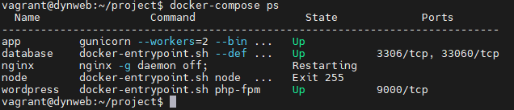
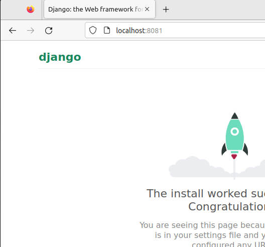
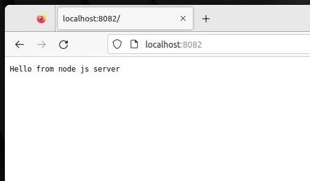
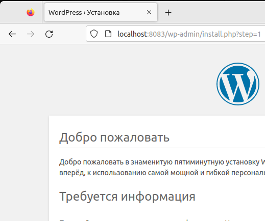

# Развертывание веб приложения
## Цели домашнего задания
Получить практические навыки в настройке инфраструктуры с помощью манифестови конфигураций. Отточить навыки использования ansible/vagrant/docker.

## Описание домашнего задания
Вариант стенда:
nginx + php-fpm (laravel/wordpress) + python (flask/django) +
js(react/angular);
Реализация:
Деплой через docker-compose

```
django     http://localhost:8081
nodejs     http://localhost:8082
wordpress  http://localhost:8083
```






